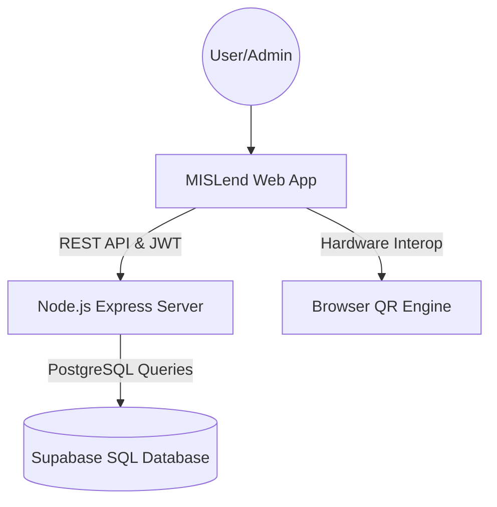

# 🛰️ MISLend: Smart Equipment Management System


**MISLend** is a professional, high-performance web application designed for the **UCC MIS Department** (University of Caloocan City - Management Information Systems) to streamline the process of borrowing and returning technical equipment. 

Built with a focus on ease of use, security, and administrative control, it is powered by a **Node.js Express backend** and **Supabase SQL (PostgreSQL)** database, replacing traditional paper-based logs with a modern QR-driven solution.

---

## 🏗️ Architecture Overview

MISLend follows a robust full-stack architecture:
- **Frontend**: Responsive Single Page Application (SPA) built with Vanilla JavaScript (ES6+), CSS3 (Flexbox/Grid), and Semantic HTML5. Zero design changes.
- **Backend**: **Node.js + Express** REST API server (`server/index.js`).
- **Database**: **Supabase SQL (PostgreSQL)** with complete relational tables and demo data (`server/schema.sql`).
- **Offline / Local Fallback**: Instant local data storage so the entire application functions immediately out-of-the-box even before configuring Supabase credentials.



---

## ✨ Key Features

### 👨‍🎓 For Students
- **Instant QR Borrowing**: Scan physical QR codes on equipment for immediate tracking.
- **Real-time Availability**: Browse available projectors, laptops, networking kits, and more.
- **Personal Dashboard**: Track current borrows, history, and return deadlines.
- **Simple Returns**: Hand back equipment and log it in seconds with condition reporting (Good/Damaged).

### 👨‍🏫 For Professors
- **Dedicated Dashboard**: Optimized workflow for faculty members.
- **Equipment Reservation**: Ensure tools are ready for classroom sessions.

### 👩‍💼 For Administrators
- **Account Approval**: Verify and approve student registrations before they can borrow.
- **Live Inventory Tracking**: Real-time counts of total, borrowed, and maintenance items.
- **Automatic Dashboard Updates**: The active dashboard list refreshes about every five seconds and when returning to the browser tab, without a full-page reload.
- **QR Generation**: Generate and download unique QR codes for new hardware directly from the dashboard.
- **Automated Logging**: Export full transaction history to Excel/CSV for institutional audits.
- **Maintenance Queue**: Flag damaged items for repair and track their status.

---

## 🛠️ Technology Stack

| Layer | Technology |
| :--- | :--- |
| **Frontend** | JavaScript (ES6+), CSS3, HTML5 |
| **Styles** | Vanilla CSS (Modern UI/UX with smooth animations) |
| **Backend** | Node.js, Express, JWT, Bcrypt |
| **Database** | Supabase SQL (PostgreSQL) |
| **Icons** | Font Awesome 6.5.0 |
| **Fonts** | Sora, DM Sans (Google Fonts) |

---

## 🚀 Quick Setup Guide

### 1. Start the Node.js Backend Server

Open your terminal in the `server` directory and run:

```bash
cd server
npm start
```

The server starts on `http://localhost:3000`.

> **Note:** The server includes an automatic local storage fallback. You can immediately open and use the application even before setting up Supabase!

### Deploy the app and API to Vercel

The repository includes a Vercel API function that serves the Express backend at `/api` alongside the static frontend. Import the repository into Vercel with the project root set to the repository root, then add these Environment Variables in **Project Settings > Environment Variables** for every deployment environment:

- `SUPABASE_URL`
- `SUPABASE_SERVICE_ROLE_KEY` (or `SUPABASE_ANON_KEY`)
- `JWT_SECRET` (use a new, randomly generated secret; do not use the development fallback)

Add the SMTP variables below as well if password verification emails are needed. Redeploy after setting environment variables. Verify the deployment by opening `https://<your-vercel-domain>/api/status`; it should return JSON with `"status":"online"` and `"database":"supabase_sql"`. The frontend uses the same-origin `/api` route, so it does not need a separate API URL. Do not deploy with local fallback storage: Vercel functions do not provide persistent local-file storage.

### Configure email delivery

Password verification codes are sent through SMTP. Copy [`server/.env.example`](server/.env.example) to `server/.env`, then set `SMTP_HOST`, `SMTP_PORT`, `SMTP_SECURE`, `SMTP_USER`, `SMTP_PASS`, and `SMTP_FROM`. For Gmail, use `smtp.gmail.com` with port `587`, enable 2-Step Verification on the sender account, and create an App Password for `SMTP_PASS` (not your regular account password). If Gmail reports `535 BadCredentials`, verify `SMTP_USER` is the full sender address and generate a fresh App Password; remove any spaces from the App Password. Restart the backend after changing the environment file. In non-production local development, an unset SMTP configuration shows a development-only code; production requires SMTP to be configured.

### 2. Connect to Your Supabase SQL Database

When you are ready to connect to your live Supabase project:

1. Create a project at [Supabase Dashboard](https://supabase.com/dashboard).
2. Go to the **SQL Editor** tab in Supabase.
3. Open [`server/schema.sql`](server/schema.sql), copy its contents, paste them into the SQL Editor, and click **Run**. This creates all tables (`users`, `equipment`, `borrowings`, `incidents`, `messages`, `feedback`, `admin_audit_logs`) and seeds sample data.
   - If the database already exists, run [`server/migrations/20261003_add_equipment_id.sql`](server/migrations/20261003_add_equipment_id.sql) or [`server/migrations/20261003_auto_increment_ids.sql`](server/migrations/20261003_auto_increment_ids.sql) in the SQL Editor.
   - For phpMyAdmin / MySQL / MariaDB (e.g. XAMPP), import [`server/schema_mysql.sql`](server/schema_mysql.sql) into your `db_mislend` database.
4. Go to **Project Settings > API** in Supabase and copy:
   - **Project URL**
   - **anon / public key** or **service_role key**
5. Open [`server/.env`](server/.env) and update your credentials:
   ```env
   SUPABASE_URL=https://YOUR_PROJECT_ID.supabase.co
   SUPABASE_ANON_KEY=YOUR_SUPABASE_ANON_KEY
   SUPABASE_SERVICE_ROLE_KEY=YOUR_SUPABASE_SERVICE_ROLE_KEY
   ```
6. Restart the backend server (`npm start`). It will automatically connect directly to Supabase SQL!

---

## 🔑 Demo Accounts

The database comes pre-seeded with the following demo accounts:

| Role | Email / ID | Password | Access |
| :--- | :--- | :--- | :--- |
| **Administrator** | `admin@cs1a.com` (or ID: `admin`) | `admin123` | Full Admin Dashboard (`admin.html`) |
| **Student** | `roshjingel@gmail.com` (or ID: `20251234-S`) | `@UCCIAN2025@` | Student Dashboard (`student.html`) |
| **Professor** | `prof@cs1a.com` (or ID: `PROF-202501`) | `admin123` | Professor Dashboard (`professor.html`) |